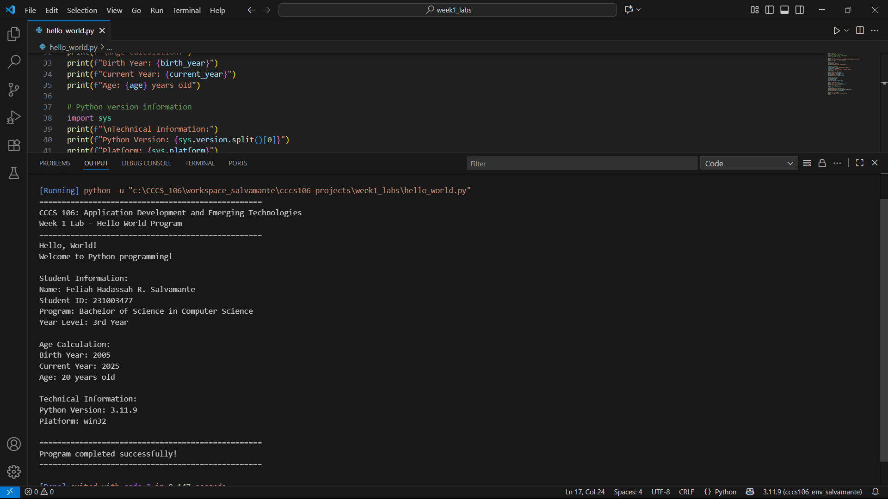
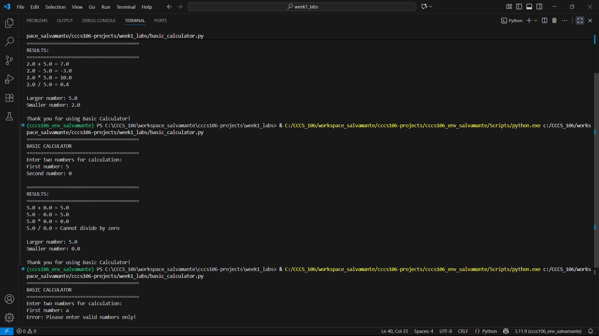
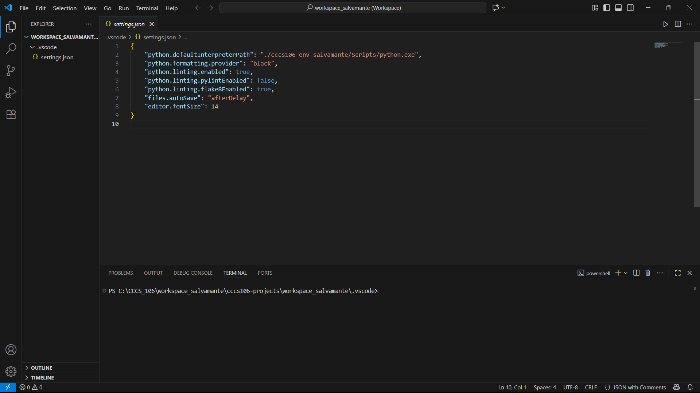

# Lab 1 Report: Environment Setup and Python Basics

**Student Name:** Feliah Hadassah R. Salvamante  
**Student ID:** 231003477  
**Section:** BSCS 3B  
**Date:** September 17, 2025  

---

## Environment Setup

### Python Installation
- **Python Version:** 3.11.9  
- **Installation Issues:** None (Python installed successfully)  
- **Virtual Environment Created:** ✅ cccs106_env_salvamante  

### VS Code Configuration
- **VS Code Version:** 1.82.0  
- **Python Extension:** ✅ Installed and configured  
- **Interpreter:** ✅ Set to `cccs106_env_salvamante/Scripts/python.exe`  

### Package Installation
- **Flet Version:** 0.28.3  
- **Other Packages:** None  

---

## Programs Created

### 1. hello_world.py
- **Status:** ✅ Completed  
- **Features:** Student info display, age calculation, system info  
- **Notes:** Worked as expected, no issues.  

### 2. basic_calculator.py
- **Status:** ✅ Completed  
- **Features:** Basic arithmetic, error handling, min/max calculation  
- **Notes:** Handled invalid input and division by zero correctly.  

---

## Challenges and Solutions
- **Challenge:** Remembering how to activate the virtual environment.  
- **Solution:** Added `cccs106_env_salvamante\Scripts\activate` as a note in the workspace settings.  

- **Challenge:** Forgetting to select the correct Python interpreter in VS Code.  
- **Solution:** Used `Python: Select Interpreter` and pointed it to the environment.  

---

## Learning Outcomes
- I learned how to install Python and create a virtual environment.  
- I practiced configuring VS Code with the correct interpreter and extensions.  
- I wrote my first Python programs and tested input validation and error handling.  

---

## Screenshots

### Hello World Output

### Calculator Division by Zero

### VS Code Interpreter

